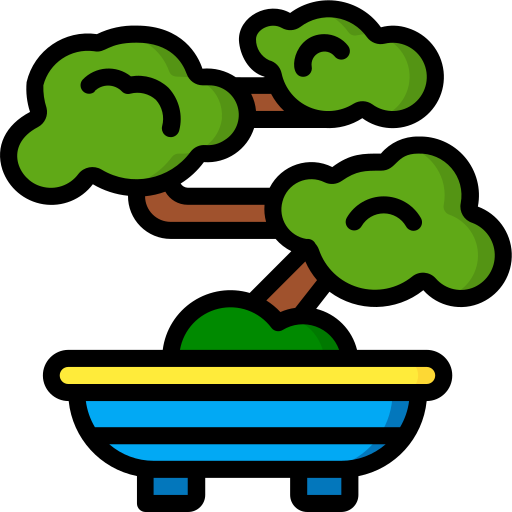

# My Portfolio

This is my portfolio page as a Full Stack Web Developer, focused on the Javascript ecosystem including: React, Node, & PostgreSQL.

----------------------------------------------------------
## Scope / About

I have studied under Zero to Mastery: The Complete Web Developer in 2020 on [Udemy](https://www.udemy.com/course/the-complete-web-developer-zero-to-mastery).  
I am currently on the Junior to Senior course, and continuing to work on improving my JS capabilities, by following courses like Free Code Camp.

As of March 2021, I am actively on the hunt to fill an extra 10 - 20 hours of dev work per week.

----------------------------------------------------------
## Project Status

The initial form is complete.
I will continue to add the list projects and also work to improve on the code.

This page is pure HTML, CSS, & JS. No bootstrap, no templates.
I love dark-theme, and the inspiration for this page came from [State of JS](https://stateofjs.com).

----------------------------------------------------------
## Tech Used

	- HTML 
	- CSS 
	- JS 
	- Github Pages

----------------------------------------------------------
## Future Plans

### First Wave

	1. Add my most recent work experieces.

### Second Wave

This page will form the basis for the new webstorm.app that will be made with React as a PWA
In the meantime here is what can still be improved:

	1. Build something fun in the Ionic framework :)
	2. Add to / fix up Complete tech Stack section
	3. Code reviews on my JS code
	4. Add something cool with JS to the page
	5. Turn all headings into accordians (maybe)
	6. Icon Hover shows the name (tooltip? or is that too boring)
	7. Menu bar hides until hover or screen touch like on video players
	8. Animate things (eg menu icon) to make it more interesting
	9.  Add pdf download to footer
	10. Add resources links to footer

----------------------------------------------------------
## Resources

  - [Icons](www.flaticon.com)
  - [Pictures](www.unsplash.com)
